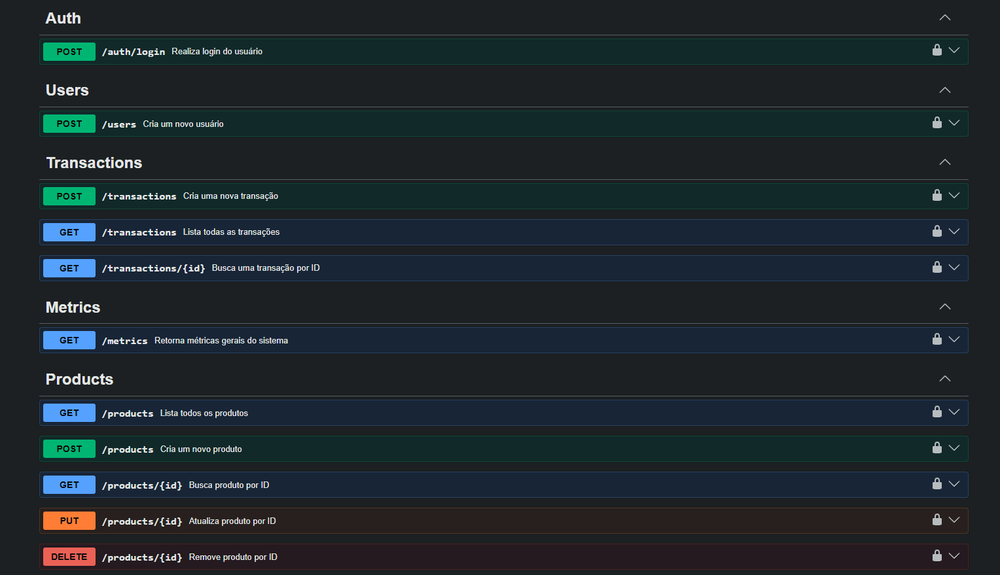

# 📦 Inventory Transactions System

Sistema completo para controle de movimentação de produtos e transações comerciais, composto por:

- 🖥 Backend API (Node.js + Prisma ORM)

O projeto está sendo desenvolvido de forma incremental e documenta a evolução de um sistema comercial orientado a regras de negócio e métricas de desempenho.

---

#  Objetivo

Construir um sistema comercial estruturado demonstrando:

- Arquitetura em camadas no backend
- Separação clara de responsabilidades
- Integridade transacional
- Modelagem relacional consistente

---

#  Regras de Negócio

- Cada transação pode conter múltiplos produtos.
- Movimentações são registradas como:
  - `ENTRADA`
  - `SAIDA`
- O valor total da transação é calculado dinamicamente com base nos itens.
- Transações são tratadas como fatos históricos (não editáveis).
- Operações que envolvem múltiplas entidades utilizam `$transaction` para garantir atomicidade.

---

# 🖥 Backend (API)

##  Tecnologias

- Node.js
- Express
- Prisma ORM
- Banco de dados relacional
- JavaScript (ES Modules)

## 🏗 Arquitetura

O backend segue arquitetura em camadas:

```
Controller
   ↓
Service (Regras de Negócio)
   ↓
Repository (Acesso a Dados)
   ↓
Prisma ORM
   ↓
Banco de Dados
```

Essa abordagem garante:

- Baixo acoplamento
- Organização do código
- Escalabilidade
- Manutenção facilitada

---

##  Funcionalidades Já Implementadas

###  Produtos
- CRUD completo de produtos

###  Clientes
- CRUD completo de clientes

###  Transações
- Criação de transações com múltiplos produtos
- Cálculo automático do valor total
- Registro automático das movimentações de estoque
- Uso de transações atômicas (`$transaction`)
- Listagem de transações por usuário

### Movimentação de Produtos
- Registro de entradas e saídas
- Consulta de movimentações com vínculo ao produto
- Associação das movimentações à transação correspondente

---

##  Em Desenvolvimento (Backend)

- Padronização de respostas da API
- Melhorias na camada de validação
- Paginação nas consultas
- Filtros por período
- Melhor tratamento de erros

---
### As principais rotas estão documentadas no Swagger UI.




### EVOLUÇÃO   
- Melhorias de arquitetura e tipagem estão sendo desenvolvidas. Pretendo migrar a API para TypeScript para verificar erros antes da execução, melhorando a confiabilidade da API e permitindo mais escalabilidade.